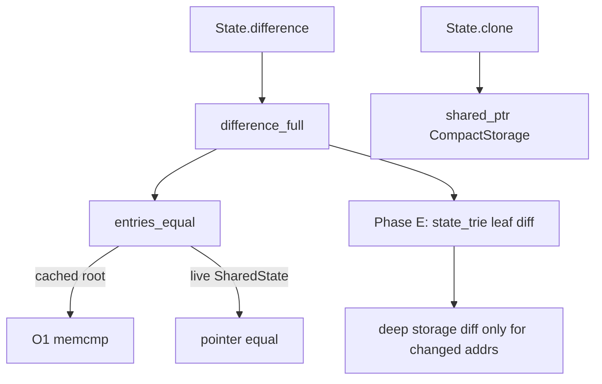

# State Diff Performance Specification v0.1.2

> **Spec type:** Change  
> **Path:** `docs/specs/change-state-diff-perf.md`  
> **Status:** Implemented (Phases A–E)

## Overview

This change eliminates multi-second `Chain.State.difference/2` walls on jump-shaped
(compact) peaks when only a few accounts change.

**Before:** The NIF rebuilt temporary Merkle trees from every `CompactStorage` slot
vector solely to compare storage roots, deep-copied those slot vectors on every
clone, scanned all accounts for equality, and had Elixir re-fetch roots
(materializing compact storage) after the NIF already did the work.

**After (shipping):** Compact storage roots are cached; live equality uses
`SharedState*`; `difference_full` is driven by `state_trie` leaf differences and
returns 6-tuples with roots; compact storage is `shared_ptr` COW on clone;
Elixir consumes NIF roots without a second `storage_root_hash` pass.

**Integration context:** `c_src/nif.cpp` (`CompactStorage`, `entries_equal`,
`storage_root_hash_for_entry`, `fork_shared_accountmap`, `account_map_difference_full`,
`account_map_storage_roots`, uncompact/compact), `lib/chain/state.ex`,
`lib/caccount_map.ex`, `lib/cmerkletree.ex`, `Model.ChainSql.prepare_state/2`,
and `scripts/state_diff_bench.exs`. On-disk BertInt block encodings MUST NOT change.

## Design Principles

1. **Never rebuild a trie only to compare roots.** Storage roots are cached data;
   deriving them on every equality check is forbidden once a root is known.
2. **O(changed) for common `prepare_state` deltas.** Full-map account scans for
   equality are unacceptable when few accounts differ.
3. **Compact storage is COW.** `State.clone/1` / `account_map_clone` MUST NOT
   deep-copy slot vectors until a write requires uniqueness.
4. **Same observable deltas.** `State.difference` / `apply_difference` round-trips
   and BertInt encodings remain bit-compatible with pre-change behavior for the
   Elixir report map shape (`{id, report}` with optional `:state` / `:root_hash`).
5. **Measure before claiming.** Each phase has a `state_diff_bench` acceptance
   gate; phases ship in order A→E and are each mergeable alone with tests green.

---

## Output Structure

**Do generate:**

- Updates under `c_src/nif.cpp` (and helpers if extracted)
- Elixir wrapper / `State.difference` updates for the NIF tuple shape
- Unit and regression tests listed in Testing
- Updates to `docs/caccount-map-nif.md` describing cache, COW, and trie-driven diff

**Do not generate:**

- Changes to BertInt / on-disk block state encoding
- Rework of `Tree::difference` internals
- Slot-vector-only storage diffs as a substitute for Phase E (deferred)
- Standalone packages or unrelated refactors

---

## Type Conventions

| Spec type | Meaning | Examples |
|-----------|---------|----------|
| `uint256_t` | 32-byte big-endian hash / root | storage root |
| `CompactStorage` | Lazy account storage: slots + optional cached root | see Phase A |
| `AccountEntry` | nonce, balance, live `merkletree*`, compact ptr, code | `c_src/nif.cpp` |
| `difference_full` entry | Erlang term from NIF | Phase C 6-tuple |
| `State.difference` report | `%{optional fields}` per address | `:nonce`, `:balance`, `:code`, `:state`, `:root_hash` |
| `nif_ms` | Wall ms inside `account_map_difference_full` | `state_diff_bench` |

### Normalization

- Elixir compact account `:root_hash` is the **storage** root (32 bytes), not the
  account RLP hash. Uncompact MUST treat it as the storage root cache seed.
- Atom `nil` in NIF root fields means “side absent”; never a zero hash.

---

## Error Handling

| Language | Error style |
|----------|-------------|
| C++ NIF | `enif_make_badarg` / existing apply error tuples |
| Elixir | Raise / existing `ArgumentError` on `apply_difference` mismatch |

| Behavior | Error when |
|----------|------------|
| `storage_root_hash_for_entry` | Unchanged: still returns false only on hard failure; cache miss MUST compute and store, not fail |
| `difference_full` | Bad resources / arity → `badarg` (unchanged) |
| `State.difference` | Malformed NIF tuple after Phase C → raise (tests catch wrapper bugs) |
| COW write | Allocation failure → existing NIF OOM / badarg paths |

Liberal inputs (legacy compact without `:root_hash`): compute root once, cache it.
Strict outputs: cached root MUST match a fresh trie hash of the same slots.

---

## Domain Rules

### Cache invalidation (Phase A)

`CompactStorage.has_root` MUST be set `false` (and root ignored) before or when
mutating slots **in place** on a compact entry. The shipping write path instead:

- Materializes compact slots into a live `merkletree`, then
- Resets `compact_storage` on that entry (refcount drop; siblings keep the shared
  compact object and its cached root)

So invalidation is ownership drop, not an in-place `has_root=false` clear.

Helpers `ensure_unique_compact` / `invalidate_compact_root` MUST exist for any
future in-place compact mutation (COW when `use_count() > 1`, then clear
`has_root`). After a true in-place invalidation, the next
`storage_root_hash_for_entry` MUST recompute once and set `has_root` again if the
entry remains compact.

### COW (Phase D)

- `shared_ptr<CompactStorage>` (or equivalent intrusive shared ownership).
- Copy/assign/fork: share the pointer; do **not** copy `slots`.
- Write path (shipping): `materialize_storage` reads shared slots into a new live
  trie, then `compact_storage.reset()` on the writing entry only.
- In-place compact mutation (if added): if `use_count() > 1`, allocate a unique
  copy (deep-copy slots + root flags), then mutate / clear `has_root`.
- `snapshot_side` MAY share the compact pointer (refcount bump); MUST NOT force a
  deep copy solely for snapshotting.

### State trie invariant (Phase E)

Every NIF that changes account RLP content (nonce, balance, code, or storage root)
MUST update `state_trie` for that address. Paths that MUST keep this invariant:

- `account_map_put` / `put` meta
- `account_map_delete`
- `account_map_storage_put_map`
- `account_map_apply_difference`
- Uncompact batch insert into `state_trie`

If a future NIF mutates account content without updating `state_trie`, Phase E
equality is wrong — such a NIF is a spec violation.

### Observable compatibility

- `State.difference/2` return type remains a list of `{addr, report}` maps.
- Report keys and semantics unchanged; only the *source* of `:root_hash` values
  changes (NIF-provided vs Elixir re-fetch).
- `apply_difference` input shape unchanged.

---

## Behaviors (Phases A–E)

Phases MUST be implemented in order. Each phase MUST leave correctness suites green
and meet its acceptance gate before the next phase merges.



### Phase A — Cache storage root on `CompactStorage`

**Data model** (`c_src/nif.cpp`):

```cpp
struct CompactStorage {
  std::vector<StorageSlot> slots;
  uint256_t root_hash;   // valid iff has_root
  bool has_root = false;
};
```

**MUST:**

| Condition | Behavior |
|-----------|----------|
| Uncompact Elixir map with `parsed.has_compact_root_hash` | Set `has_root=true` and copy root onto the new `CompactStorage` (not only pass override into `AccountHashCtx::compute`) |
| `storage_root_hash_for_entry` + compact + `has_root` | Return cached root; **no** temporary `Tree` |
| `storage_root_hash_for_entry` + compact + `!has_root` | Build tree **once**, store root on compact, return it |
| `make_compact_account_term` | Emit Elixir `:root_hash` from cache or one-time compute |
| Storage mutation | Invalidate `has_root` per Domain Rules |
| Live `storage != nullptr` | Unchanged: use tree `root_hash()` |

**MUST NOT:** Discard a known root and rebuild on the next compare.

**Acceptance:**  
`mix run --no-start scripts/state_diff_bench.exs -- --scenario compact_small_delta --accounts 14000 --changed 20 --slots 32 --warmup 1 --iters 2`  
→ avg `nif_ms` **&lt; 50** (baseline ~700+).

**Rationale:** Uncompact already parses `:root_hash`; caching it removes the
prod “accounts=20 / multi-second” hotspot without changing algorithms.

---

### Phase B — Live `SharedState*` equality

**`entries_equal` order MUST be:**

1. Meta mismatch (nonce / balance / code) → not equal.
2. Both `storage` non-null and `a.storage->shared_state == b.storage->shared_state` → equal.
3. Else both wrappers identical (`a.storage == b.storage`) → equal.
4. Else compare storage roots via `storage_root_hash_for_entry` (Phase A cache / live).

**Acceptance:** `locked_peak_delta` / `live_small_delta` latency no worse than
pre-change; `test/cmerkle_account_map_diff_test.exs` and
`test/chain_state_merkle_test.exs` pass.

**Rationale:** Fork installs distinct wrappers sharing `SharedState` until write;
wrapper-only equality missed the cheap path.

---

### Phase C — NIF returns storage roots; Elixir stops double fetch

**NIF entry shape for `account_map_difference_full`:**

| Version | Term |
|---------|------|
| Before | `{addr, side_a, side_b, storage_diff}` |
| After (MUST) | `{addr, side_a, side_b, storage_diff, root_a, root_b}` |

- `root_*`: 32-byte binary, or atom `nil` if that side is absent.
- Roots MUST be the storage roots for each present side (from cache / live tree),
  computed during the diff without requiring Elixir callbacks.

**Elixir `Chain.State.difference/2` MUST:**

- Pattern-match the 6-tuple.
- Set `:root_hash` from `{root_a, root_b}` when storage diff is non-empty (decode
  `nil` sides consistently with absent accounts).
- **MUST NOT** call `CAccountMap.storage_root_hash/2` for those roots.

**`account_map_storage_roots` / storage root reads MUST:**

- If compact + `has_root`, return the cached root **without** `materialize_storage`.
- Otherwise existing behavior (materialize or compute-and-cache).

Update: `lib/caccount_map.ex`, `lib/cmerkletree.ex`, and every consumer that
pattern-matches `difference_full` tuples (tests, fuzz, stress).

**Acceptance:** Identical `State.difference` report maps vs pre-change on existing
suites; `elixir_ms` ≈ 0 on storage-touching bench deltas; root-only reads do not
force materialize when cache hit.

---

### Phase D — `shared_ptr` COW for `CompactStorage`

**MUST:**

- Replace `unique_ptr<CompactStorage>` with `shared_ptr<CompactStorage>` on
  `AccountEntry` and `DiffAccountSide`.
- Copy / assign / `fork_shared_accountmap` (via `accounts = src->accounts`): share
  pointer only — no `slots = src->slots` deep copy in the default copy path.
- COW before mutating slots or invalidating root when `use_count() > 1`.
- `snapshot_side`: share compact pointer; keep live storage `enif_keep_resource`
  as today.

**Acceptance:** Clone of compact peak (14k accounts × 32 slots): RSS growth
order-of-magnitude below today’s full slot duplication (target: well under ~2×
full slot payload duplication). `test/cmerkle_nif_leak_test.exs` passes.

**Rationale:** Live storage already COWs via `SharedState::has_clone`; compact was
the outlier that doubled RAM on every `State.clone/1`.

---

### Phase E — `state_trie`-driven `difference_full`

**Algorithm MUST:**

1. If `am_a->shared == am_b->shared` → return `[]` (existing).
2. If both maps’ `state_trie->shared_state` pointers are identical → return `[]`.
3. Else build the candidate address set from the **symmetric difference of
   state_trie leaves** (hash differs, or key only on one side). MUST NOT scan all
   `accounts` entries solely to run `entries_equal` on unchanged hashes.
4. For each candidate only: snapshot sides + `build_storage_diff_list` as today;
   emit Phase C 6-tuples.
5. Accounts present in one map but missing from the other MUST still appear
   (trie miss / accounts lookup as needed for that address).

**Acceptance:**  
`compact_small_delta` and `live_small_delta` with `--accounts 14000 --changed 20`:
avg `nif_ms` **&lt; 20**. Full-map equality walk absent from profiles.

**Rationale:** Account RLP hash embeds storage root; trie leaf inequality is a
sound filter for “this address needs a deep diff” under the state_trie invariant.

---

## Out of Scope

- BertInt / on-disk block state encoding changes
- Replacing `Tree::difference` with a new algorithm
- Pure slot-vector diff without trees for fat-storage accounts (may follow later)
- Changing the public Elixir `State.difference/2` report map shape

---

## Testing

### Perf gates (`scripts/state_diff_bench.exs`)

| Phase | Scenario / flags | Gate |
|-------|------------------|------|
| A | `compact_small_delta` 14k / 20 / 32 | avg `nif_ms` &lt; 50 |
| E | `compact_small_delta` and `live_small_delta` 14k / 20 | avg `nif_ms` &lt; 20 |
| C | storage-touching scenarios | `elixir_ms` ≈ 0 |

### Correctness suites

```text
mix test test/cmerkle_account_map_diff_test.exs \
  test/chain_state_merkle_test.exs \
  test/cmerkle_lock_clone_regression_test.exs
```

### Memory

- `mix test test/cmerkle_nif_leak_test.exs`
- Phase D: `cow_unique_after_write` includes an RSS smoke check on compact clone
  (`test/state_diff_perf_contract_test.exs`)

### Required unit cases

Covered by `test/state_diff_perf_contract_test.exs` (must stay green):

| Name | Assert |
|------|--------|
| `cached_root_after_uncompact` | Compact→uncompact preserves storage roots; compact Elixir structs carry `:root_hash` |
| `root_invalidated_after_storage_put` | After `storage_put_map`, root changes and `State.difference` reports `{before, after}` |
| `cow_unique_after_write` | Clone + write does not mutate parent; compact clone RSS growth stays well below full slot duplication |
| `difference_full tuple shape` | 6-tuple `{addr, side_a, side_b, storage_diff, root_a, root_b}` |
| `compact_small_delta prepare_state shape` | Few changed accounts on compact peak round-trip via difference/apply |

Production NIF surface: `test/count_zeros_test.exs`, `test/caccount_map_test.exs`,
`test/cmerkle_nif_leak_test.exs` (nif_stats).

### Integration

- Existing chain state / `prepare_state` round-trips remain green.
- Implementations MAY add tests; suites above MUST pass unchanged in intent.

---

## Integration Docs

**Where it lives:** NIF hot path in `c_src/nif.cpp`; Elixir orchestration in
`lib/chain/state.ex` (`difference/2`); SQL writer path
`Model.ChainSql.prepare_state/2` calls `State.difference/2` for non-jump blocks.

**How to call:** Unchanged for product code — `Chain.State.difference/2` /
`apply_difference/2`. Benchmark:

```bash
mix run --no-start scripts/state_diff_bench.exs -- \
  --scenario compact_small_delta --accounts 14000 --changed 20 --slots 32
```

**Migration:** No on-disk migration. Deploy is a rolling binary upgrade. Phase C
changes only the internal NIF tuple; keep wrappers and tests in the same commit
as the NIF.

**Agent notes:** See also `docs/caccount-map-nif.md` (ownership, clone/lock).

---

## Implementation Checklist

- [x] Contract tests: `test/state_diff_perf_contract_test.exs`
- [x] Phase A: `CompactStorage` root cache + invalidation + uncompact seed
- [x] Phase A bench gate (`nif_ms` &lt; 50)
- [x] Phase B: `SharedState*` equality in `entries_equal`
- [x] Phase C: 6-tuple NIF + Elixir stops double `storage_root_hash` (update tuple-shape test)
- [x] Phase C: `storage_roots` uses compact cache (no materialize-for-root)
- [x] Phase D: `shared_ptr` COW; fork no longer deep-copies slots
- [x] Phase D leak / RSS acceptance
- [x] Phase E: state_trie-driven candidate set; `nif_ms` &lt; 20
- [x] All listed correctness tests green
- [x] `docs/caccount-map-nif.md` updated for cache, COW, trie-driven diff
- [x] Each phase mergeable alone with tests green

---

## Version History

- **v0.1.2** — Docs/spec aligned with shipping behavior: status, COW write path
  (materialize+drop), Phase D RSS contract, LOCK_ORDER / bench commentary.
- **v0.1.1** — Phases A–E implemented (cached compact roots, SharedState* equality,
  6-tuple roots, CompactStorage `shared_ptr` COW, state_trie-driven `difference_full`).
- **v0.1.0** — Initial specification (Phases A–E locked).
